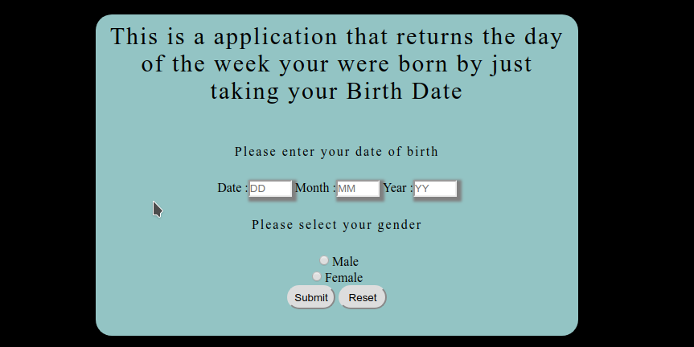
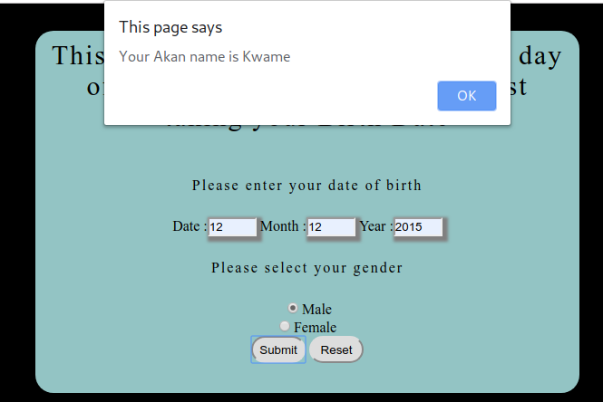

# Akan Name Generator

 ## By Albert Byrone

 
 ### It is a description of the application before it gives the output

 
 ### It is a description of the application after it generates the Akan name

 ## Description

 
This is an application that generates Akans names and alerts the user of the name based on date ,month and year of birth

## Features

As a user of the application,you will be able to :

1. See a  small description of what the application does on the landing page.
1. Enter your  birthday through a form 

1. Choose what gender you are .

1. Click the submit button to see what your  Akan name would be

## Behaviour Driven Development

| Behaviour      | Input     | Output     |
| :------------- | :----------: | -----------: |
|  Page loads     | User click the submit button without filling the form    | An error box is diplayed to the user.    |
 ###  Requirements

 * Access to  a computer or any other garget

 * Access to internet

 ### Installation Process

 ****  
Click on the link below to download the app or

Clone to thir repo : git clone https://github.com/Albert-Byrone/akan-app.git

Unzip the downloaded files in a folder of choice.

Open the index file with any browser.
 ****
### Live Link 

### Technology  Used
* HTML - which was used to develope the structure off the pages.

* CSS - which was used to style the User Interface.

* JAVASCRIPT - which was used for DOM(Document Object Manipulation) scripts.

## Licence

MIT License

Copyright (c) [2019] [Albert Byrone]

Permission is hereby granted, free of charge, to any person obtaining a copy
of this software and associated documentation files (the "Software"), to deal
in the Software without restriction, including without limitation the rights
to use, copy, modify, merge, publish, distribute, sublicense, and/or sell
copies of the Software, and to permit persons to whom the Software is
furnished to do so, subject to the following conditions:

The above copyright notice and this permission notice shall be included in all
copies or substantial portions of the Software.

THE SOFTWARE IS PROVIDED "AS IS", WITHOUT WARRANTY OF ANY KIND, EXPRESS OR
IMPLIED, INCLUDING BUT NOT LIMITED TO THE WARRANTIES OF MERCHANTABILITY,
FITNESS FOR A PARTICULAR PURPOSE AND NONINFRINGEMENT. IN NO EVENT SHALL THE
AUTHORS OR COPYRIGHT HOLDERS BE LIABLE FOR ANY CLAIM, DAMAGES OR OTHER
LIABILITY, WHETHER IN AN ACTION OF CONTRACT, TORT OR OTHERWISE, ARISING FROM,
OUT OF OR IN CONNECTION WITH THE SOFTWARE OR THE USE OR OTHER DEALINGS IN THE
SOFTWARE.

## Authors Info

Slack Profile - [Albert Byrone](https://app.slack.com/client/T077KKCG6/GLRQR61NW/user_profile/UKXCHMCNP?cdn_fallback=1)

Linked - [Albert Byrone](https://www.linkedin.com/in/albert-byrone-664811144/)

 
